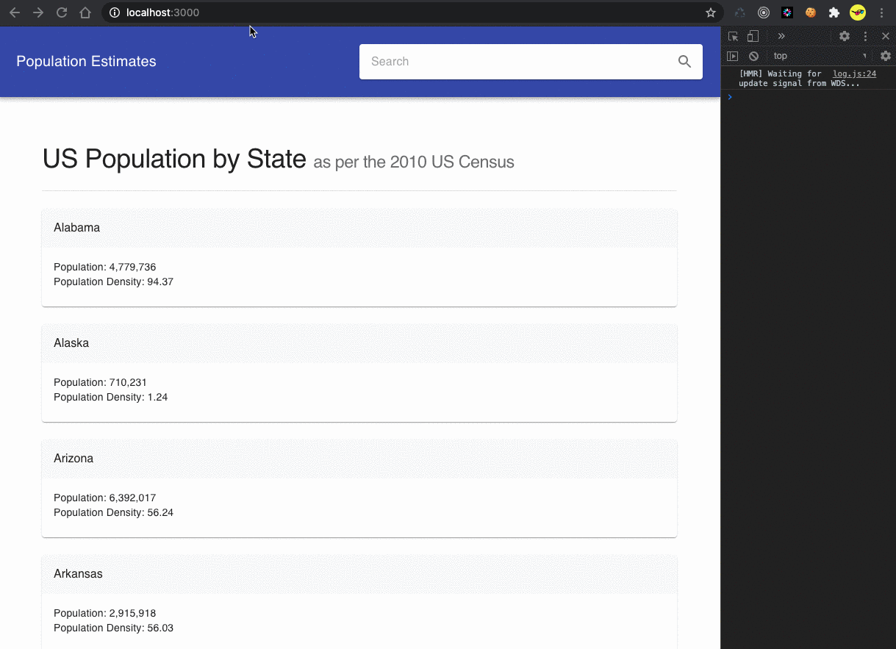

# Challenge

- Accepted and completed: https://reactjs-challenge.web.app

Clone and re-create the current Angular App, this time make it work in React. Please feel free to use:

- Lodash.

- Material UI.

- React Context State Management.

Note: Please ask an recruiter to grant you permission to the Angular app before you can start this challenge.



## Create `Component Route Pages` and `Components` for:

- States

- Counties

Consume Rest APIs from (please have fun with the CSV format):

- https://api.census.gov/data/2019/pep/population?get=NAME,POP,DENSITY&

  - 'for=state:\*&DATE_CODE=1'

  - `for=county:*&in=state:${Number(stateId)}`

## Why a Long-Term Support version has been chosen?

Becuase the LTS version will be supported and maintained by the Node.js project for an extended period of time.

## Simple security audit passed!

```
npm audit fix
```

## Stretch Goals

- Done: Search Bar.

- Pending: Unit Tests.

## Happy Hacking!!!

It would be great to find a chance to briefly discuss this simple React approach, I’d be glad to hear back from you.

## So... What's Next?
